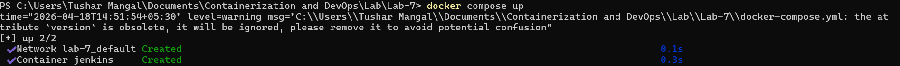
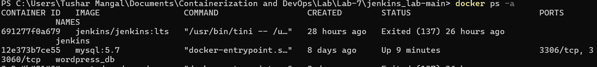
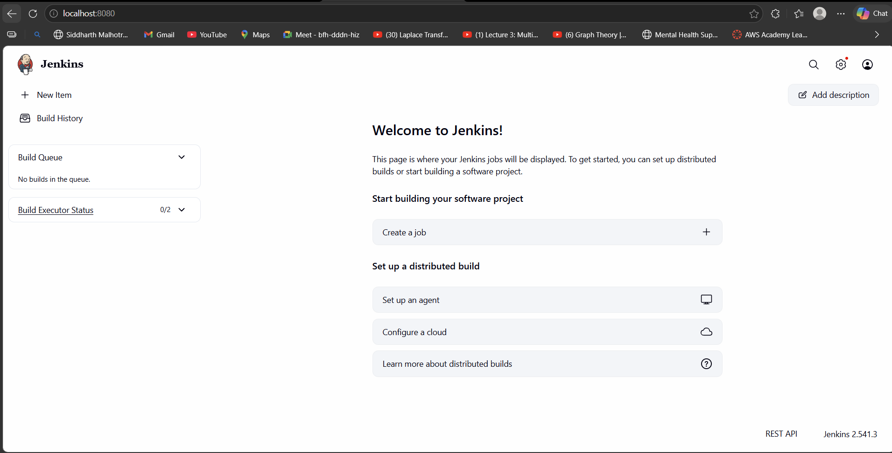
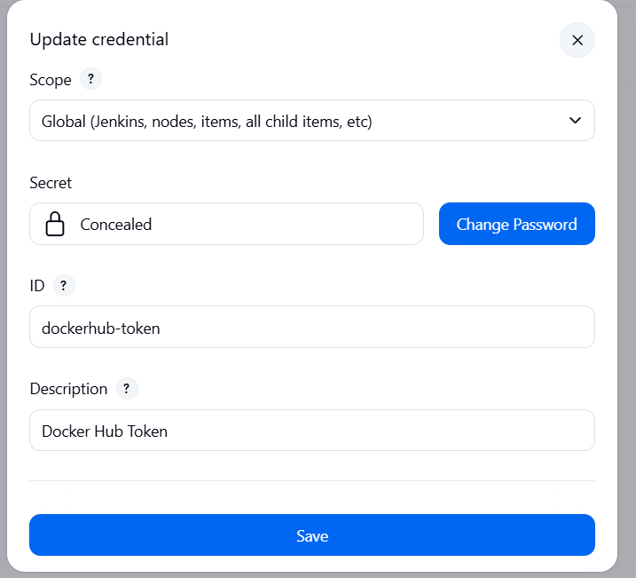
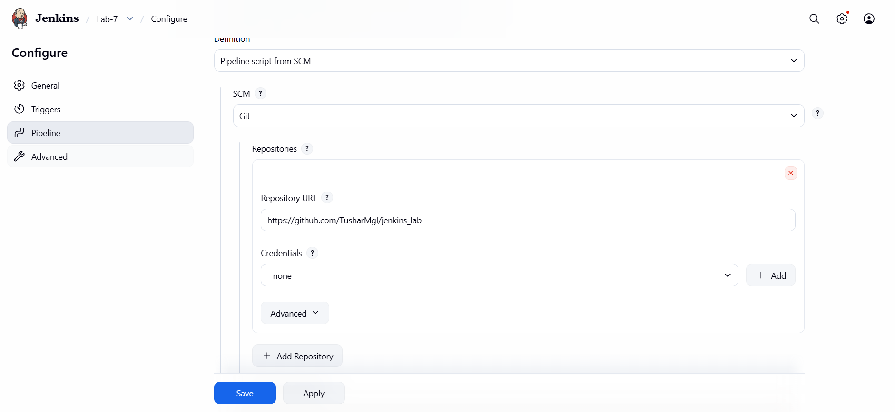
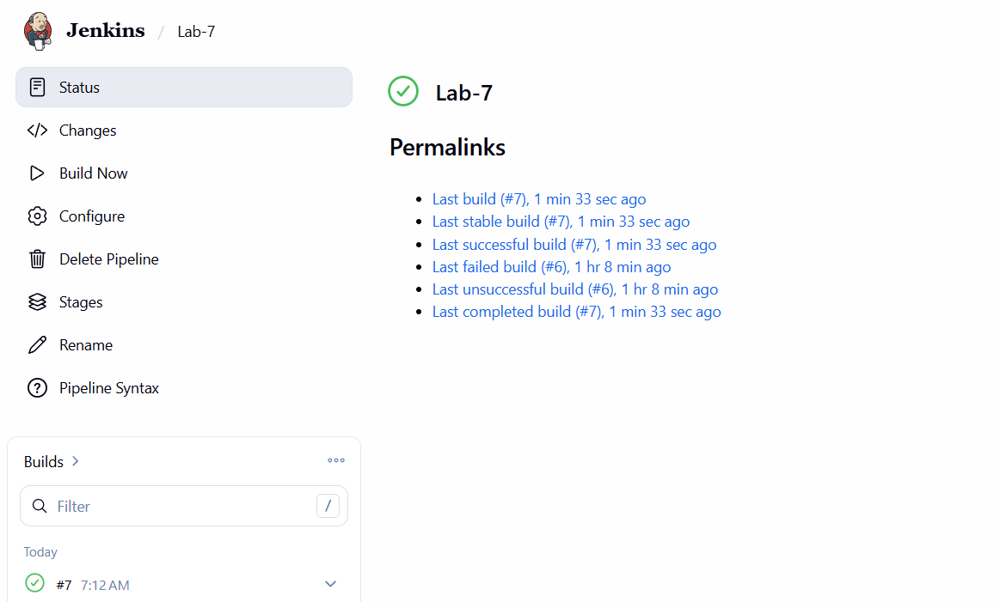
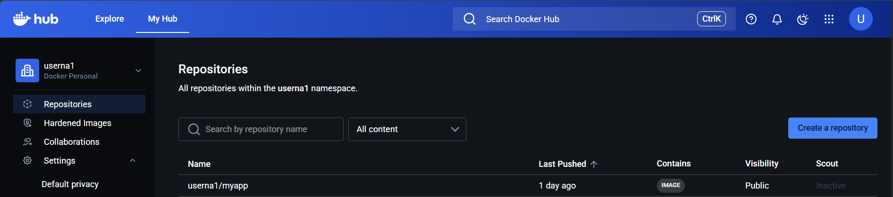

# Lab 7: CI/CD using Jenkins, GitHub & Docker Hub

## 1. Aim

To build a complete CI/CD pipeline using:

- **GitHub** — Source code repository
- **Jenkins** — Automation server
- **Docker Hub** — Container image storage

---

## 2. Objective

- Understand the CI/CD workflow end-to-end
- Automate the build and push process using Jenkins
- Write a Jenkins pipeline using `Jenkinsfile`
- Store credentials securely inside Jenkins
- Trigger automated builds using GitHub Webhooks

---

## 3. What is CI/CD?

### CI – Continuous Integration

Code is automatically built and tested after every commit pushed to GitHub.

### CD – Continuous Deployment

The tested application is automatically packaged and deployed without manual steps.

### Flow Diagram

```
Developer → GitHub → Webhook → Jenkins → Docker Hub
```

---

## 4. What is Jenkins?

Jenkins is a **GUI-based open-source automation server** that enables:

- **Building** applications
- **Testing** code automatically
- **Deploying** to target environments

### Key Features

| Feature          | Description                                    |
| ---------------- | ---------------------------------------------- |
| Web Dashboard    | Visual interface to manage jobs and pipelines  |
| Plugin Support   | 1800+ plugins for every major tool             |
| Pipeline as Code | Define your full CI/CD flow in a `Jenkinsfile` |
| Credential Store | Securely handles secrets and tokens            |

---

## 5. Project Structure

```
jenkins_lab-main/
 ├── app.py
 ├── requirements.txt
 ├── Dockerfile
 └── Jenkinsfile
```

---

## 6. Application Code (Flask)

**app.py**

```python
from flask import Flask
app = Flask(__name__)

@app.route("/")
def home():
    return "Hello from CI/CD Pipeline!"

app.run(host="0.0.0.0", port=80)
```

**requirements.txt**

```
flask
```

---

## 7. Dockerfile

```dockerfile
FROM python:3.10-slim
WORKDIR /app
COPY . .
RUN pip install -r requirements.txt
EXPOSE 80
CMD ["python", "app.py"]
```

---

## 8. Jenkinsfile (Pipeline)

The `Jenkinsfile` defines the full CI/CD pipeline as code:

```groovy
pipeline {
    agent any

    environment {
        IMAGE_NAME = "your-dockerhub-username/myapp"
    }

    stages {
        stage('Clone Source') {
            steps {
                git 'https://github.com/your-username/my-app.git'
            }
        }

        stage('Build Docker Image') {
            steps {
                sh 'docker build -t $IMAGE_NAME:latest .'
            }
        }

        stage('Login to Docker Hub') {
            steps {
                withCredentials([string(credentialsId: 'dockerhub-token', variable: 'DOCKER_TOKEN')]) {
                    sh 'echo $DOCKER_TOKEN | docker login -u your-dockerhub-username --password-stdin'
                }
            }
        }

        stage('Push to Docker Hub') {
            steps {
                sh 'docker push $IMAGE_NAME:latest'
            }
        }
    }
}
```

### Pipeline Stages Explained

| Stage                 | What It Does                                |
| --------------------- | ------------------------------------------- |
| `Clone Source`        | Pulls the latest code from GitHub           |
| `Build Docker Image`  | Runs `docker build` to create the image     |
| `Login to Docker Hub` | Authenticates using stored token credential |
| `Push to Docker Hub`  | Uploads the built image to Docker Hub       |

---

## 9. Jenkins Setup using Docker

We run Jenkins itself as a Docker container for easy setup.

**docker-compose.yml**

```yaml
version: "3.8"
services:
  jenkins:
    image: jenkins/jenkins:lts
    container_name: jenkins
    ports:
      - "8080:8080"
      - "50000:50000"
    volumes:
      - jenkins_home:/var/jenkins_home
      - /var/run/docker.sock:/var/run/docker.sock
    user: root

volumes:
  jenkins_home:
```

> **Why mount `/var/run/docker.sock`?**
> This allows Jenkins (running inside a container) to communicate with the host Docker daemon — so it can build and push images directly from within the pipeline.

### Starting Jenkins

```bash
docker compose up -d
```

Then open: **http://localhost:8080**

---

## 10. Jenkins Configuration

### Step 1 – Add Docker Hub Credentials

Navigate to:

```
Manage Jenkins → Credentials → System → Global credentials → Add Credentials
```

- **Kind:** Secret text
- **ID:** `dockerhub-token`
- **Secret:** Your Docker Hub access token

### Step 2 – Create a Pipeline Job

1. Click **New Item**
2. Select **Pipeline**
3. Under **Pipeline Definition**, select `Pipeline script from SCM`
4. Set **SCM** to Git and paste your GitHub repo URL
5. Jenkins will automatically pick up the `Jenkinsfile` from the repo root

---

## 11. Webhook Integration

### In GitHub

1. Go to your repo → **Settings → Webhooks → Add webhook**
2. Set the Payload URL to:
   ```
   http://<your-jenkins-ip>:8080/github-webhook/
   ```
3. Content type: `application/json`
4. Trigger on: **Push events**

Now every `git push` will automatically trigger the Jenkins pipeline!

---

## 12. Execution Flow

```
Step 1: Developer pushes code to GitHub
         ↓
Step 2: GitHub sends a Webhook notification to Jenkins
         ↓
Step 3: Jenkins Pipeline runs:
        → Clone code
        → Build Docker image
        → Login to Docker Hub
        → Push image
         ↓
Step 4: Image is now live on Docker Hub
```

---

## 13. Key Concept: `withCredentials`

### Problem

Hardcoding passwords in `Jenkinsfile` exposes secrets in version control.

### Solution

```groovy
withCredentials([string(credentialsId: 'dockerhub-token', variable: 'DOCKER_TOKEN')]) {
    sh 'echo $DOCKER_TOKEN | docker login -u your-dockerhub-username --password-stdin'
}
```

Jenkins:

- Fetches the secret from the encrypted credentials store
- Injects it as an environment variable **temporarily**
- Automatically masks it from all logs
- Removes it from memory after the block completes

---

## 14. Key Commands in Pipeline

| Command        | Purpose                                    |
| -------------- | ------------------------------------------ |
| `git`          | Clone the source code repository           |
| `sh`           | Execute a shell command on the agent       |
| `docker build` | Build a Docker image from the `Dockerfile` |
| `docker login` | Authenticate with Docker Hub               |
| `docker push`  | Upload the image to Docker Hub             |

---

## 15. Observations & Screenshots

The following screenshots document the complete setup and execution of this CI/CD pipeline.

### Jenkins Running via Docker Compose




### Jenkins Initial Setup & Dashboard



### Adding Docker Hub Credentials in Jenkins



### Pipeline Job Configuration



### Pipeline Build Execution


### Image Successfully Pushed to Docker Hub



---

## 16. Result

Successfully created a complete automated CI/CD pipeline:

| Component      | Role                                         |
| -------------- | -------------------------------------------- |
| **GitHub**     | Stores source code, triggers webhook on push |
| **Jenkins**    | Automates build, login, and push stages      |
| **Docker**     | Provides consistent build environment        |
| **Docker Hub** | Stores and distributes the built image       |

Every `git push` now **automatically** results in a new Docker image on Docker Hub — with **zero manual steps**.

---

## Key Takeaways

1. **Jenkins automates** the entire pipeline — no manual intervention needed after setup.
2. **GitHub stores code** and acts as the trigger source via webhooks.
3. **Docker ensures consistency** — the same image runs anywhere.
4. **`withCredentials`** safely handles secrets without exposing them in logs or code.
5. **Pipeline as Code** (`Jenkinsfile`) keeps your CI/CD logic version-controlled alongside your app.

---

